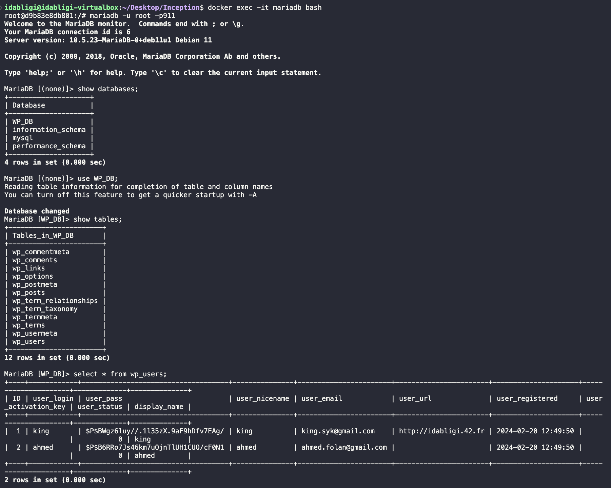

<h1 align="center">Inception</h1>

# Table of Contents
1. [Subject Requirements](#subject-requirements)
2. [Docker](#docker)
   - [I. Definition](#docker-definition)
   - [II. Docker Architecture](#docker-architecture)
   - [III. Docker CMD](#docker-cmd)
   - [IV. How Docker Works ?](#how-docker-works)
   - [V. Docker Isolation](#docker-isolation)
   - [VI. Does Docker Containers Share the Host OS Kernel?](#docker-container-sharing-kernel)
3. [MariaDB](#mariadb)
   - [I. Definition](#mariadb-definition)
   - [II. History of MariaDB](#history-of-mariadb)
   - [III. MariaDB CMD](#mariadb-cmd)
   - [IV. MariaDB Configuration](#mariadb-configuration)
4. [WordPress](#wordpress)
   - [Definition](#wordpress-definition)
   - [WordPress Configuration](#wordpress-configuration)
5. [Nginx](#nginx)
   - [Definition](#nginx-definition)
   - [HTTPS](#https)
   - [HTTPS Certification](#https-cert)
   - [SSL](#ssl)
   - [HOW DOES SSL WORKS ?](#how-ssl)
   - [Nginx Configuration](#nginx-configuration)
6. [Resources](#resources)

---

## I. Subject Requirements 
   - This project consists in having you set up a small infrastructure composed of different
services under specific rules. The whole project has to be done in a virtual machine. You
have to use docker compose.

  
   
  

  <a href="https://cdn.intra.42.fr/pdf/pdf/103030/en.subject.pdf" target="_blank">Inception Subject Link</a>

---

## II. Docker 

### I. Definition 
- `Docker` is a tool that can package an application and its dependencies into an isolated container.
- `Docker Container` is an isolated workspace.
- `Docker image` is a blueprint or a template for creating Docker containers. It provides all the necessary instructions and dependencies required to create and run a containerized application.
- `Docker compose` is a tool that allows you to define and manage multi-container Docker applications. It provides a convenient way to describe the services, networks, and volumes required for your application in a declarative YAML file.
- `Docker volume` is a persistent data storage mechanism that allows containers to share and store data outside of their individual file systems. Volumes are used to persist and share data between containers, as well as between containers and the host machine.
- `Docker network` is a virtual infrastructure that enables communication between containers and the host machine. Docker networks provide isolation, security, and flexibility for containerized applications.
- `Dockerd` shortcut of Docker Daemon which is the core component of the Docker platform. It is responsible for building, running, and managing Docker containers. When you install Docker on your system, it includes the Docker Engine along with other tools and services.
- `Containerd` shortcut of Container Daemon which manages the complete container lifecycle of its host system, from image transfer and storage to container execution and supervision to low-level storage to network attachments and beyond.
### II. Docker Architecture 
- `Docker` uses a client-server architecture. The `Docker client` talks to the `Docker daemon`, which does the heavy lifting of building, running, and distributing your `Docker containers`. The Docker client and daemon can run on the same system, or you can connect a Docker client to a remote Docker daemon. The Docker client and daemon communicate using a REST API, over UNIX sockets or a network interface. Another Docker client is Docker Compose, that lets you work with applications consisting of a set of containers.

  
  
  
#### The Docker daemon
   The Docker daemon `dockerd` listens for Docker API requests and manages Docker objects such as images, containers, networks, and volumes. A daemon can also communicate with other daemons to manage Docker services.

#### The Docker client
   The Docker client `docker` is the primary way that many Docker users interact with Docker. When you use commands such as docker run, the client sends these commands to dockerd, which carries them out. The docker command uses the Docker API. The Docker client can communicate with more than one daemon.

### III. Docker CMD 

| Command | Description |
| :----------- | :----------- |
| docker build . -t `(image)` | This command tells Docker to build an image based on the Dockerfile in the current directory and tag it with the name `(image)`. |
| docker images | list docker images. |
| docker run --name `(ctr)` `(image)`  | start a new Docker container `(ctr)` from an image `(image)`. |
| docker run -d --name ctr image | start a new Docker container `(ctr)` from an image `(image)` in the background. |
| docker run -p `443:443` --name ctr image | The -p option specifies the port mapping. It tells Docker to map port 443 from the container to port 443 on the host machine. The format is <host_port>:<container_port>.|
| docker run -v `VolumeName`:`/path/in/container` ... | This command mounts the volume `VolumeName` inside the container at the specified `/path/in/container` location. |
| docker ps | This command is used to list all the running Docker containers. |
| docker stop `(ctr)` | This command is used to stop a running container. |
| docker rm -f `(ctr)` | This command is used to remove a Docker container. |
| docker rmi -f `(ctr)` | This command is used to remove a Docker image. |
| docker kill | Kill one or more running containers. |
| docker exec -it `(ctr)` bash| start an interactive bash session inside the specified container `(ctr)`.

**NOTE :** 
There are more commands to use with docker but in this table I specified the top essential Docker commands that you might need in the process of creating your own containers.

### IV. How Docker Works ? 
   Docker is written in the `Go programming language` and takes advantage of several features of the Linux kernel to deliver its functionality. Docker uses a technology called `namespaces` to provide the isolated workspace called the container. When you run a container, Docker creates a set of namespaces for that container.
   
   The process of building Docker images and running containers in relation to Docker, containerd, and runc.

  

**Building Docker Images:**

1. When you issue a `docker build` command with a Dockerfile, it is the Docker daemon (`dockerd`) that handles the build process.
2. The Docker daemon reads the Dockerfile instructions and orchestrates the build process. It pulls necessary base images, executes each instruction, and creates the desired image following the defined steps.
3. During the build process, the Docker daemon interacts with containerd to manage the image layers, intermediate containers, and storage operations.

**Running Containers:**

1. When you run a Docker container using the `docker run` command, it is the Docker daemon (`dockerd`) that handles the container creation and execution.
2. The Docker daemon communicates with containerd and instructs it to create a container based on the specified image.
3. Containerd, as the container runtime, then utilizes runc to create and manage the container process with the appropriate namespaces, cgroups, and other isolation mechanisms.

### V. Docker Isolation 
   Docker utilizes namespaces and cgroups, which are features provided by the Linux kernel, to achieve isolation for each container.

**Namespaces**

   Namespaces play a crucial role in Docker. Docker utilizes namespaces to provide process isolation and resource virtualization, allowing containers to operate as isolated environments within a shared host operating system.

   Here's how namespaces help Docker:

1. Process isolation: Docker uses the PID (Process ID) namespace to provide each container with its own isolated view of processes. Each container has its own set of process IDs, separate from other containers and the host system. This isolation ensures that processes within a container cannot interfere with or access processes outside of it.
2. Network isolation: Docker leverages network namespaces to provide network isolation for containers. Each container has its own isolated network stack, including network interfaces, IP addresses, routing tables, and firewall rules. This isolation allows containers to have their own networking configuration and prevents network conflicts between containers.
3. File system isolation: Mount namespaces enable Docker containers to have their own isolated view of the file system. Each container has its own set of mounted directories and file systems, independent of other containers and the host system. This isolation ensures that changes made within a container's file system do not affect other containers or the host system.
4. User isolation: User namespaces provide user and group ID isolation for Docker containers. They allow containers to have their own set of user and group IDs, separate from the host system. This isolation enhances security by preventing container processes from accessing or affecting the host system's user accounts.

**Cgroups**

   Cgroups, short for control groups, are a feature in the Linux kernel that provide resource isolation and allocation for processes. Cgroups allow you to control and limit the resources (such as CPU, memory, disk I/O, and network bandwidth) that a group of processes can use.
   
   When it comes to Docker containers, cgroups play an important role in resource management and isolation. Docker leverages cgroups to allocate and limit system resources for each container, preventing one container from monopolizing system resources and impacting the performance of other containers or the host system.

**NOTE :** 
   when a process inside a container creates a child process the new child process by default inherits the cgroups and namespaces of he’s parent process.

  

### VI. Does Docker Containers Share the Host OS Kernel? 

**LinuxOS :**

   On Linux Docker containers share the host operating system's kernel, which means they run on the same kernel as the host machine. This allows containers to be lightweight and provides efficient resource utilization.

**MacOS :**

   On `macOS`, Docker utilizes a lightweight virtualization technology called "Hyperkit" to run Linux containers. Hyperkit is a hypervisor that is part of the Docker Desktop for Mac application. It provides a Linux environment using a virtual machine running on macOS.

   When you install Docker Desktop for Mac on macOS, it includes a small Linux distribution running inside a lightweight virtual machine (Hyperkit).

**WindowsOS:**

   On Windows, Docker Desktop utilizes a different lightweight virtualization technology called "Hyper-V" to run Linux containers. Hyper-V is a native hypervisor developed by Microsoft and is included in certain editions of Windows, such as Windows 10 Professional and Enterprise.

   When Docker Desktop is installed on a Windows machine with Hyper-V enabled, it creates a Linux-based virtual machine (VM) known as the "MobyLinuxVM" to host and manage the Linux containers. This VM runs alongside the Windows operating system and provides the necessary infrastructure for running Docker containers.

---

## III. MariaDB 

### I. Definition 

   - `MariaDB` is an open source database to help store and organize data. It’s similar to MySQL (a database management system) and, in fact, a fork to MySQL. The MariaDB database is used for various purposes such as data warehousing, e-commerce, enterprise-level features, and logging applications.
   - `Database` is a place to store information that you can quickly retrieve and use where you need it. Compared to writing information on a piece of paper or in a Word document, a database saves all your information in tables so that you can easily retrieve each individual entry in a systematic and precise way.

### II. History of MariaDB 
   
   - `MySQL` was initially completely open-source , then it was bought by `Oracle`, since then several organizations have become concerned about Oracle's possibility of making paid its software.
   To prevent this, the `MariaDB` foundation creates a version almost identical to MySQL, but completely **open-source**.

### III. MariaDB CMD 

| Command | Description |
| :----------- | :----------- |
| service `mariadb` start | Start the Mariadb server. |
| mysqld_safe `&` | Starts the MariaDB server in safe mode as a background process. The & symbol is used to run the command in the background, allowing the script to continue executing while the server is running. |
| mysqld_safe | Starts the MariaDB server in safe mode as a foreground process. |
| mariadb | Access to mariadb as root user. |
| mariadb -u `user` -p`password` -h `host` | Access mariadb using mariadb-client from another machine. -u `user` specifies the username to use when connecting to the database server. `-p...` is used to provide the password for the specified user {no space between -p and the password}. `-h ...` specifies the hostname or IP address of the machine where the MariaDB database server is running. |
| mysql -e "ALTER USER 'root'@'localhost' IDENTIFIED BY `password`;" | set a password for the mariadb root user. |
| show databases; | Reveal all mariadb databases. |
| use `(name of a database)`; | Acces to that specific database. |
| create database `(name of new database)`; | Create a database. |
| show tables; | Reveal all tables of that database. |
| create table `(name of new table)(arg1, arg2,…)`; | Creating a new table. |
| explain `(name of a table)`; | Reveal all the arguments of that table. |
| select * from `(name of a table)`; | Reveal the table values. |
| insert `(table()) value(arg1, arg2, arg3..)`; | Insert values to a specific table. |
| update `(table)` set `(the value to change)`=`new value` where std_id=`2`; | Change an added value. |
| select user from `mysql.user`; | Reveal mariadb users. |
| create user `user`@`%`; | Creat user, `%` represents the host or the location from which the user is allowed to connect. The '%' wildcard symbol means that the user can connect from any host. If you want to restrict connections to specific hosts, you can replace '%' with the desired hostname or IP address. |
| create user `user`@`localhost` identified by `password`; | Create user with a password, the localhost will make the user only acces the mariadb from the hostmachine that's running the mariadb server.|
| drop user `user`@`localhost`; | Drop user. |
| GRANT ALL PRIVILEGES ON `*.*` TO `user`@`%`; | This command grants all privileges (ALL PRIVILEGES) to the user `user` for all databases `(*.*)` and all tables within those databases. |
| FLUSH PRIVILEGES; | Ensure the changes take effect. |

**NOTE :** 

You might not need all this commands for the `Inception` project since the `Wordpress` will do all the job for us. But at least you need to know how to acces and reveal the tables inside your mariadb database;

**Here's an example of accesing to a Wordpress Database and revealing all data inside of the table `wp_users`:**

  

### IV. MariaDB Configuration 

To configure MariaDB for WordPress, we need to modify the `50-server.cnf` file located at `/etc/mysql/mariadb.conf.d/50-server.cnf`.

By default, the configuration file contains the line `bind_address=localhost`. This setting restricts the MariaDB server to listen only on the local machine's IP address, preventing access from other machines.

However, for WordPress to connect to the MariaDB server, we need to change the value from `localhost` to `0.0.0.0` This modification allows the MariaDB server to listen and be accessible from any machine on the network.

After making this change, WordPress will be able to establish a connection with the MariaDB server, enabling proper communication between the two.

---

## IV. WordPress 

### Definition 

- `WordPress` is a popular content management system (CMS) that allows users to create and manage websites and blogs easily. It is written in PHP and uses a MySQL or MariaDB database to store content and settings.

### WordPress Configuration 

#### Step 1: Set up WP-CLI
    curl -O https://raw.githubusercontent.com/wp-cli/builds/gh-pages/phar/wp-cli.phar
    chmod +x wp-cli.phar && mv wp-cli.phar /usr/local/bin/wp
   - In this step, we set up WP-CLI, a powerful command-line tool for managing WordPress installations. We download the WP-CLI executable, make it executable, and move it to the /usr/local/bin directory. This ensures that WP-CLI is globally accessible from the command line, enabling us to interact with WordPress using simple and convenient commands.

#### Step 2: Download WordPress
    cd /var/www/html
    wp core download --allow-root
    mv wp-config-sample.php wp-config.php
- In this step, we navigate to the desired directory where we want to install WordPress, typically the web server's document root. We use WP-CLI to download the latest version of the WordPress core files directly from the official WordPress repository.

#### Step 3: Configure WordPress
    wp config set SERVER_PORT 3306 --allow-root
    wp config set DB_NAME $DB_NAME --allow-root --path=/var/www/html
    wp config set DB_USER $MARIA_DB_USER --allow-root --path=/var/www/html
    wp config set DB_PASSWORD $MARIA_DB_USER_PASSWORD --allow-root --path=/var/www/html
    wp config set DB_HOST 'mariadb:3306' --allow-root --path=/var/www/html
- In this step, we use WP-CLI to configure the WordPress installation by modifying the wp-config.php file. We set the server port for the database connection, providing the necessary information for connecting to the MariaDB server. We specify the database name, username, password, and host, ensuring that WordPress can establish a secure and reliable connection to the database server.

#### Step 4: Install WordPress
    wp core install --url=$DOMAIN_NAME --title=INCEPTION --admin_user=$WP_ADMIN_USER --admin_password=$WP_ADMIN_PASSWORD --admin_email=$WP_ADMIN_EMAIL --allow-root --path=/var/www/html
    wp user create $WP_USER $WP_USER_EMAIL --role=author --user_pass=$WP_USER_PASSWORD --allow-root --path=/var/www/html
- In this final step, we use WP-CLI to install WordPress with the specified configuration. We provide essential details such as the website URL, site title, and administrative user credentials. This command automates the installation process, creating the necessary database tables, generating encryption keys, and setting up the initial administrative user. Additionally, we create a new user with the author role, allowing them to contribute and manage content on the WordPress website.

---

## V. Nginx 

### I. Definition 
- `Nginx` pronounced like “engine-ex”, is an open-source web server software used for reverse proxy, load balancing, and caching. It provides HTTPS server capabilities and is mainly designed for maximum performance and stability.

### II. HTTPS 
- `HTTPS` Hypertext Transfer Protocol Secure is a secure version of HTTP. This protocol enables secure communication between a client (e.g. web browser) and a server (e.g. web server) by using encryption. HTTPS uses Transport Layer Security (TLS) protocol or its predecessor Secure Sockets Layer (SSL) for encryption.

   The original use for HTTPS was for ecommerce transactions, email, and other sensitive data transfers. Today it has become the standard for all websites.
   HTTPS uses a well-known TCP port 443. If the port is not specified in a URL, browsers will use this port when sending HTTPS request.

### III. HTTPS Certification 
- `HTTPS` employs `SSL` (Secure Socket Layer) or its successor, `TLS` (Transport Layer Security), to establish an encrypted connection between a web server and a client's browser. SSL/TLS certificates play a crucial role in enabling HTTPS by verifying the authenticity and identity of the server. These certificates are issued by trusted Certificate Authorities and contain cryptographic keys that facilitate secure communication. When a website has a valid SSL/TLS certificate installed, it allows for the encryption of sensitive information, such as login credentials and financial transactions, providing an essential layer of security and ensuring the privacy and integrity of data transmitted between the server and the client.

  

### IV. SSL 
- `SSL` Secure Sockets Layer is a standard security technology for establishing an encrypted link between a server and a client—typically a web server (website) and a browser, or a mail server and a mail client (e.g., Outlook). It is more widely known than `TLS`, or Transport Layer Security, the successor technology of SSL.

### V. HOW DOES SSL WORKS ? 

When a browser attempts to access a website that is secured by SSL, the browser and the web server establish an SSL connection using a process called an “SSL Handshake” (see diagram below). Note that the SSL Handshake is invisible to the user and happens instantaneously.

Essentially, three keys are used to set up the SSL connection: the public, private, and session keys. Anything encrypted with the public key can only be decrypted with the private key, and vice versa.

Because encrypting and decrypting with private and public key takes a lot of processing power, they are only used during the SSL Handshake to create a symmetric session key. After the secure connection is made, the session key is used to encrypt all transmitted data.

  
  

1. **Browser** connects to a web server (website) secured with SSL (https). Browser requests that the server identify itself.
2. **Server** sends a copy of its SSL Certificate, including the server’s public key.
3. **Browser** checks the certificate root against a list of trusted CAs and that the certificate is unexpired, unrevoked, and that its common name is valid for the website that it is connecting to. If the browser trusts the certificate, it creates, encrypts, and sends back a symmetric session key using the server’s public key.
4. **Server** decrypts the symmetric session key using its private key and sends back an acknowledgement encrypted with the session key to start the encrypted session.
5. **Server** and Browser now encrypt all transmitted data with the session key.

### Nginx Configuration 
- The behavior of the Nginx server is determined by its configuration file, typically located at `/etc/nginx/sites-available/default`. This configuration file serves as a vital blueprint, defining how Nginx operates. Within this file, I have made specific adjustments to customize the server's behavior according to the desired requirements and functionality of the subject.

      server {
           listen 443 ssl;
           ssl_protocols TLSv1.3;
           ssl_certificate ${CERTS_PATH};
           ssl_certificate_key /etc/nginx/ssl/NG.key;

           # Set the root directory, index files, and server name
           root /var/www/html;
           server_name ${DOMAIN_NAME};
           index index.php index.html index.htm;

           location ~ \.php$ {
           # Include the FastCGI configuration for PHP
           include snippets/fastcgi-php.conf;
           fastcgi_pass wordpress:9000;
          }
      }

   - **listen 443 ssl;** : This line specifies that the server should listen on port 443 (the default HTTPS port) and use SSL/TLS for secure communication.
   - **ssl_protocols TLSv1.3;** : It sets the desired SSL/TLS protocol version to TLS 1.3 for secure connections.
   - **ssl_certificate ${CERTS_PATH};** : This directive provides the path to the SSL/TLS certificate file used for encryption. ${CERTS_PATH} is a placeholder that should be replaced with the actual certificate path.
   -  **ssl_certificate_key /etc/nginx/ssl/NG.key;** : It specifies the path to the private key corresponding to the SSL/TLS certificate.
   - **root /var/www/html;**: Sets the root directory where the web server will look for files to serve.
   - **server_name ${DOMAIN_NAME};** : Specifies the domain name associated with the server block.
   - **index index.php index.html index.htm;** : Defines the order in which the server will look for index files (e.g., index.php, index.html, index.htm).
   - **location ~ \.php$ { ... }** : This block handles requests for PHP files. It includes a configuration file (snippets/fastcgi-php.conf) that manages the FastCGI process for PHP and forwards requests to the WordPress container at wordpress:9000.

## VI. Resources
